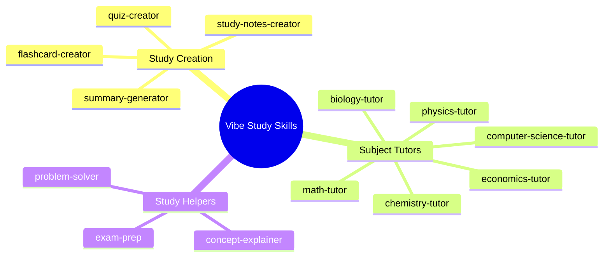

# 📚 Vibe Study Skills

A collection of AI skills designed to supercharge your studying. These skills transform AI assistants into specialized study companions.




## 🎯 Skills Overview

### Study Creation Skills
| Skill | Description |
|-------|-------------|
| [study-notes-creator](skills/study-notes-creator) | Create organized, visual study notes with diagrams |
| [quiz-creator](skills/quiz-creator) | Generate quizzes with MCQ, True/False, and more |
| [flashcard-creator](skills/flashcard-creator) | Create Anki-compatible flashcards |
| [summary-generator](skills/summary-generator) | Condense materials into digestible summaries |

### Subject Expert Skills
| Skill | Topics Covered |
|-------|----------------|
| [chemistry-tutor](skills/chemistry-tutor) | Organic, Inorganic, Physical, Analytical |
| [physics-tutor](skills/physics-tutor) | Mechanics, E&M, Thermodynamics, Modern Physics |
| [math-tutor](skills/math-tutor) | Algebra, Calculus, Statistics, Linear Algebra |
| [computer-science-tutor](skills/computer-science-tutor) | Algorithms, Data Structures, Big-O |
| [biology-tutor](skills/biology-tutor) | Cell Biology, Genetics, Ecology, Evolution |
| [economics-tutor](skills/economics-tutor) | Micro, Macro, Policy, International Trade |

### Study Helper Skills
| Skill | Description |
|-------|-------------|
| [exam-prep](skills/exam-prep) | Study schedules, review sheets, practice tests |
| [problem-solver](skills/problem-solver) | Step-by-step problem solving with explanations |
| [concept-explainer](skills/concept-explainer) | ELI5-style explanations with analogies |

---

## 🚀 Getting Started

### Installation

You can install these skills directly into your AI assistant using the `skills` CLI:

```bash
npx skills add https://github.com/szeyu/vibe-study-skills
```

This will prompt you to select which skills you want to install.

```bash
➜  vibe-study-skills git:(main) ✗ npx skills add https://github.com/szeyu/vibe-study-skills.git

███████╗██╗  ██╗██╗██╗     ██╗     ███████╗
██╔════╝██║ ██╔╝██║██║     ██║     ██╔════╝
███████╗█████╔╝ ██║██║     ██║     ███████╗
╚════██║██╔═██╗ ██║██║     ██║     ╚════██║
███████║██║  ██╗██║███████╗███████╗███████║
╚══════╝╚═╝  ╚═╝╚═╝╚══════╝╚══════╝╚══════╝

┌   skills 
│
◇  Source: https://github.com/szeyu/vibe-study-skills.git
│
◇  Repository cloned
│
◇  Found 13 skills
│
◆  Select skills to install (space to toggle)
│  ◻ biology-tutor (Biology subject expertise for study notes,
problem-solvin...)
│  ◻ chemistry-tutor
│  ◻ computer-science-tutor
│  ◻ concept-explainer
│  ◻ economics-tutor
│  ◻ exam-prep
│  ◻ flashcard-creator
│  ◻ math-tutor
│  ◻ physics-tutor
│  ◻ problem-solver
│  ◻ quiz-creator
│  ◻ study-notes-creator
│  ◻ summary-generator
└
```

Select the skills you want to use


### Usage

Simply describe what you need:

- *"Create a quiz from my chapter 5 notes"*
- *"Help me with this physics problem"*
- *"Explain entropy like I'm 5"*
- *"Make flashcards for organic chemistry reactions"*
- *"Create a 1-week study plan for my calculus exam"*

---

## 🤝 Contributing

Feel free to:
- Add new subject skills
- Improve existing skill references
- Suggest new study helper skills

---

## 📄 License

MIT License - See [LICENSE](LICENSE) for details.
