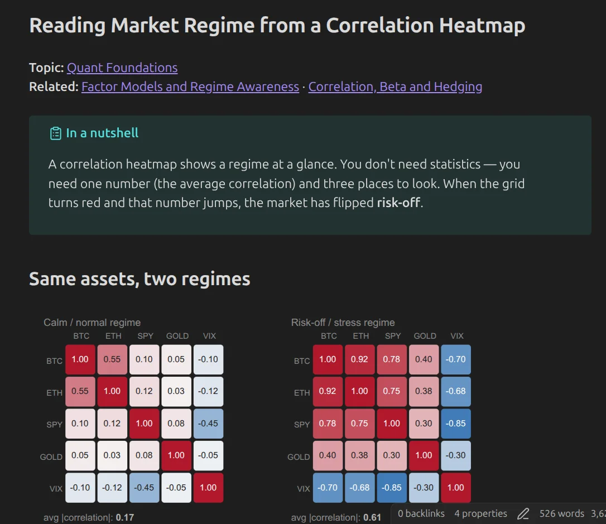
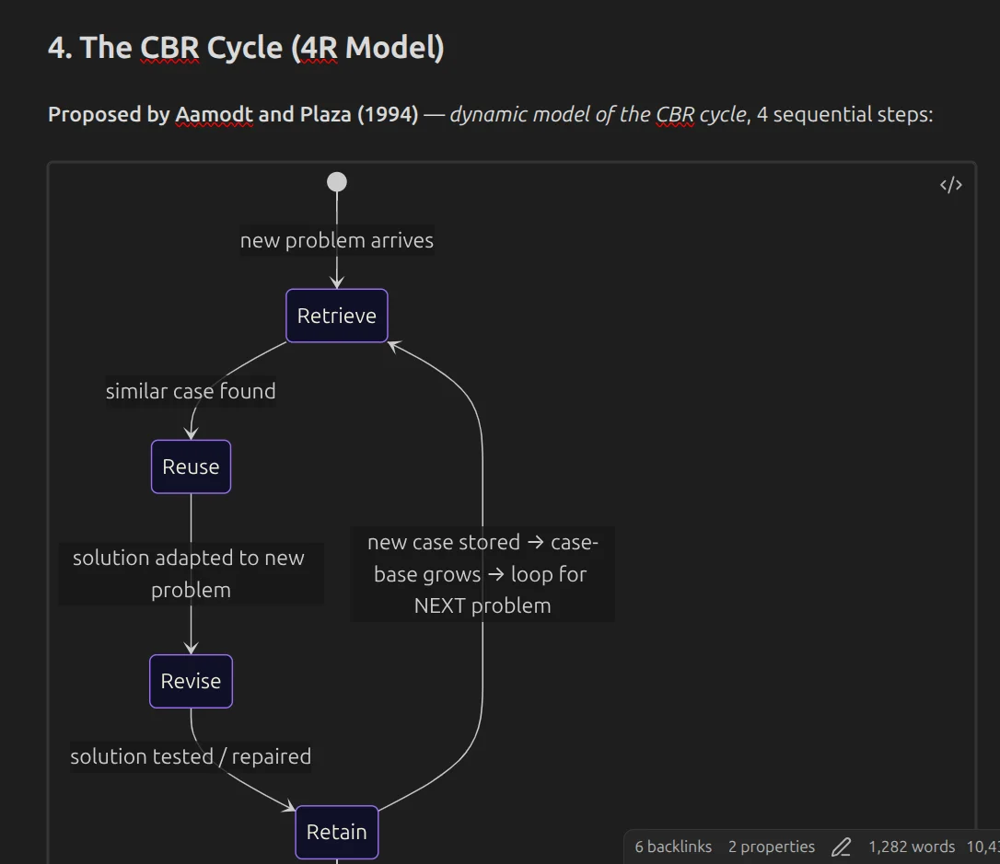
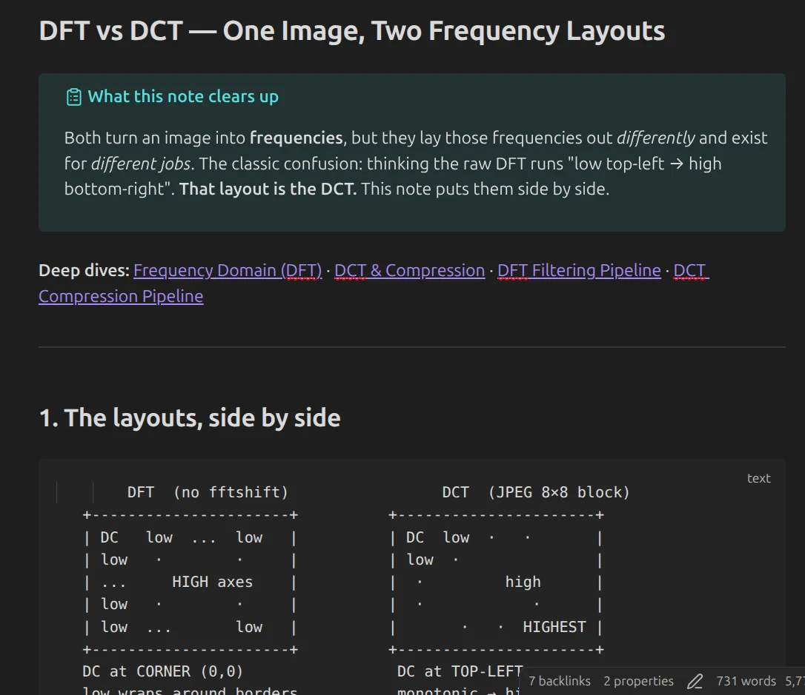

# 📚 Obsidian Notes Creator

An AI skill for creating high-quality Obsidian study notes — with rich analogies, diagrams, and structured explanations that genuinely teach.

---

## What It Does

The `obsidian-notes-creator` skill transforms source material (lecture slides, PDFs, textbooks, rough notes) into polished Obsidian markdown. It knows how to:

- Write **intuition-first** explanations with complete worked examples
- Use **analogies** where helpful, explaining their limits
- Choose suitable **ASCII, Mermaid, or SVG visuals**, with white SVG backgrounds
- Use **Obsidian callouts** purposefully, keeping solutions visible
- Create or improve **single notes and topic sets**, preserving existing folders

---

## See It In Action

Real notes produced by the skill, showing its three visual styles:

**Embedded SVG — data figures** (a correlation-regime heatmap)



**Mermaid — processes & cycles** (the CBR 4R model)



**ASCII + callouts — side-by-side contrast** (DFT vs DCT)



---

## Installation

```bash
npx skills add https://github.com/szeyu/vibe-study-skills
```

---

## Usage

Just describe what you need:

- *"Create study notes from this lecture on contrastive learning"*
- *"Turn these rough notes on MoCo into an Obsidian note with analogies"*
- *"Organise my ML notes into a multi-file structure"*
- *"Generate a note for self-supervised learning with diagrams and examples"*

---

## Skill Structure

```
skills/obsidian-notes-creator/
├── SKILL.md
└── references/
    ├── components/         ← Obsidian syntax (callouts, diagrams, frontmatter, wikilinks)
    ├── writing/            ← How to write content that teaches (analogies, examples, comparisons)
    ├── structure/          ← When to split into multiple files, templates
    ├── quality-checklist.md
    └── verification.md
```

---

## License

Apache License 2.0 — see [LICENSE](LICENSE)
