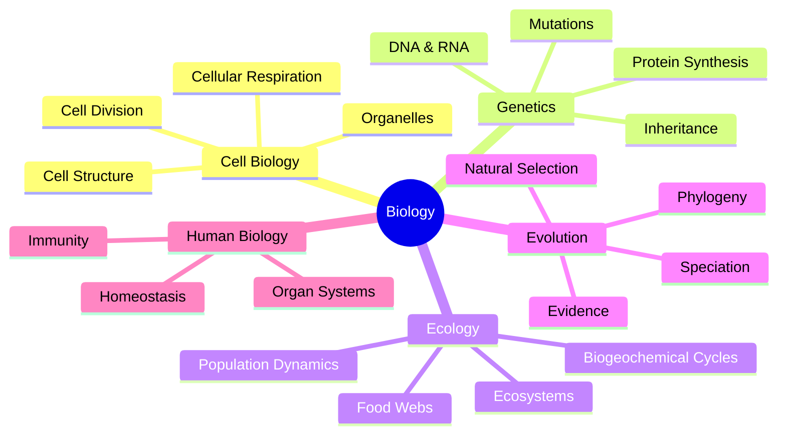
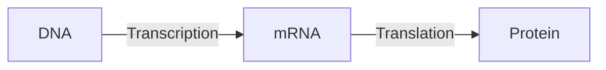
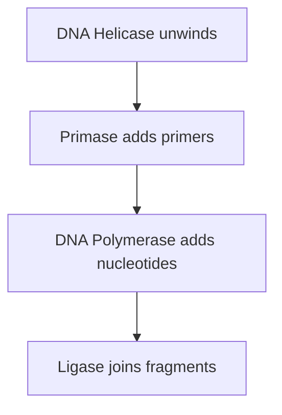
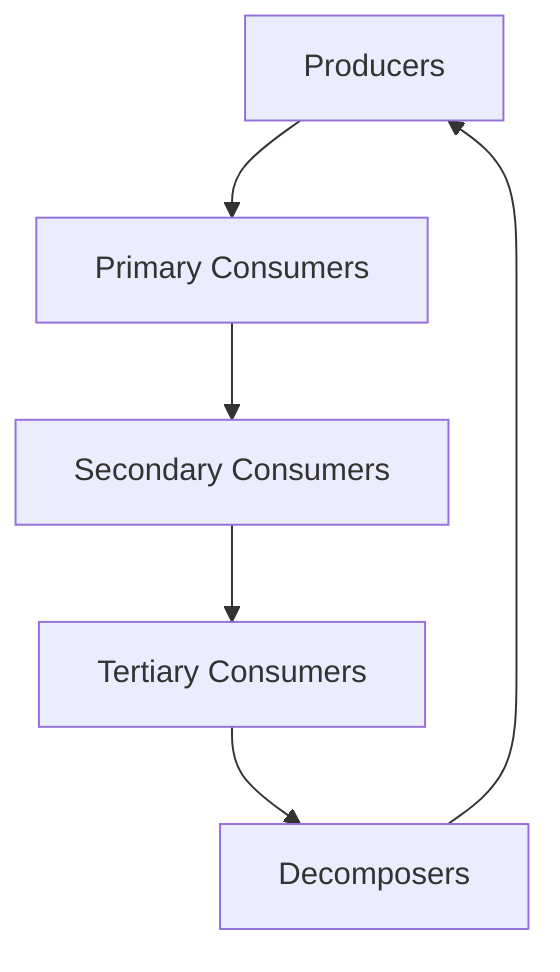

# Biology Subject Expert

Specialized knowledge for biology studying, concept explanation, and note creation.

## Topic Coverage



---

## Diagram Patterns

### Cell Diagram (ASCII)

```
    ┌─────────────────────────────────────────┐
    │           Cell Membrane                  │
    │  ┌─────────┐      ○ Ribosome            │
    │  │ Nucleus │  ~~~~ ER                   │
    │  │  DNA    │      ⬡ Mitochondria        │
    │  └─────────┘      ▢ Golgi               │
    │           Cytoplasm                      │
    └─────────────────────────────────────────┘
```

### Process Diagram (Mermaid)



---

## Key Processes

### Cellular Respiration

$$C_6H_{12}O_6 + 6O_2 \rightarrow 6CO_2 + 6H_2O + ATP$$

| Stage | Location | ATP Yield |
|-------|----------|-----------|
| Glycolysis | Cytoplasm | 2 ATP |
| Krebs Cycle | Mitochondria matrix | 2 ATP |
| ETC | Mitochondria membrane | 32-34 ATP |

### Photosynthesis

$$6CO_2 + 6H_2O + Light \rightarrow C_6H_{12}O_6 + 6O_2$$

| Stage | Location | Products |
|-------|----------|----------|
| Light Reactions | Thylakoid | ATP, NADPH, O₂ |
| Calvin Cycle | Stroma | Glucose |

### DNA Replication



---

## Genetics Quick Reference

### Punnett Square Pattern

```
        A       a
    ┌───────┬───────┐
  A │  AA   │  Aa   │
    ├───────┼───────┤
  a │  Aa   │  aa   │
    └───────┴───────┘
```

### Inheritance Patterns

| Pattern | Description |
|---------|-------------|
| Dominant | One allele masks the other |
| Recessive | Only expressed when homozygous |
| Codominant | Both alleles fully expressed |
| Incomplete | Blended phenotype |
| Sex-linked | Gene on X or Y chromosome |

---

## Classification

### Domain → Species

```
Domain → Kingdom → Phylum → Class → Order → Family → Genus → Species
```

**Mnemonic:** "Dear King Philip Came Over For Good Soup"

### Three Domains

| Domain | Cell Type | Examples |
|--------|-----------|----------|
| Bacteria | Prokaryote | E. coli |
| Archaea | Prokaryote | Methanogens |
| Eukarya | Eukaryote | Plants, Animals, Fungi |

---

## Ecology Concepts

### Trophic Levels



### Energy Rule
Only ~10% of energy transfers between trophic levels.
