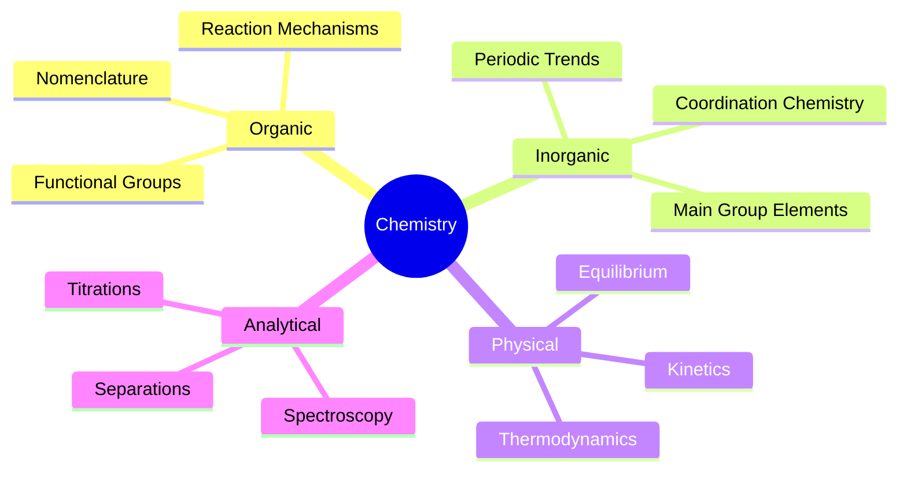
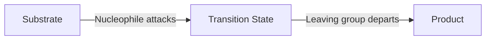

# Chemistry Subject Expert

Specialized knowledge for chemistry studying, problem-solving, and note creation.

## Topic Coverage



---

## Quick Reference Links

- **Formulas and Constants:** See [formulas.md](references/formulas.md)
- **Organic Reactions:** See [organic-reactions.md](references/organic-reactions.md)
- **Periodic Table Data:** See [periodic-table.md](references/periodic-table.md)

---

## Diagram Patterns

### Molecular Structure (ASCII)

```
        H   H
         \ /
          C = C
         / \
        H   H
      (Ethene)
```

### Reaction Mechanism (Mermaid)



### Electron Configuration

```
1s² 2s² 2p⁶ 3s² 3p⁶ 4s² 3d¹⁰ 4p⁶
```

---

## Problem-Solving Patterns

### Stoichiometry Problems

1. **Write balanced equation**
2. **Convert given to moles** (using molar mass or molarity)
3. **Use mole ratio** from balanced equation
4. **Convert to requested units**

### pH Calculations

| Type | Formula |
|------|---------|
| Strong acid | pH = -log[H⁺] |
| Strong base | pOH = -log[OH⁻], pH = 14 - pOH |
| Weak acid | pH = ½(pKa - log C) |
| Buffer | pH = pKa + log([A⁻]/[HA]) |

### Redox Balancing (Acidic Solution)

1. Separate into half-reactions
2. Balance atoms except O and H
3. Balance O with H₂O
4. Balance H with H⁺
5. Balance charge with e⁻
6. Multiply to equalize electrons
7. Add half-reactions

---

## Common Notation

| Symbol | Meaning |
|--------|---------|
| (aq) | Aqueous solution |
| (s) | Solid |
| (l) | Liquid |
| (g) | Gas |
| ⇌ | Reversible reaction |
| → | Forward reaction |
| Δ | Heat applied |
| ↑ | Gas evolved |
| ↓ | Precipitate formed |

---

## Lewis Structure Steps

1. Count total valence electrons
2. Draw skeleton structure (central atom)
3. Place bonding pairs
4. Distribute remaining electrons as lone pairs
5. Check octets (or duets for H)
6. Form multiple bonds if needed
