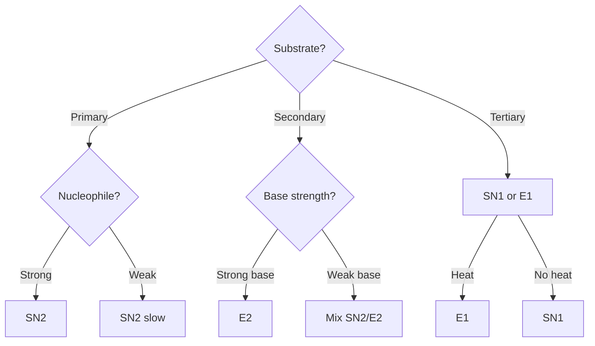

# Organic Reaction Mechanisms

Quick reference for common organic reaction types and mechanisms.

## Reaction Types Overview

| Type | Key Feature | Example |
|------|-------------|---------|
| SN1 | Carbocation intermediate | tert-butyl bromide + water |
| SN2 | Backside attack, inversion | methyl bromide + hydroxide |
| E1 | Carbocation, then elimination | tert-butyl bromide + heat |
| E2 | Concerted elimination | cyclohexyl bromide + strong base |
| Addition | Add to C=C | alkene + HBr |
| Elimination | Remove to form C=C | alcohol + acid/heat |

---

## Substitution Reactions

### SN1 (Substitution Nucleophilic Unimolecular)

```
R-X  →  R⁺ + X⁻  (slow, rate-determining)
R⁺ + Nu⁻  →  R-Nu  (fast)
```

**Favored by:**
- Tertiary substrate (stable carbocation)
- Weak nucleophile
- Polar protic solvent
- Good leaving group

### SN2 (Substitution Nucleophilic Bimolecular)

```
Nu⁻ + R-X  →  [Nu---R---X]‡  →  Nu-R + X⁻
```

**Favored by:**
- Primary/methyl substrate (less steric hindrance)
- Strong nucleophile
- Polar aprotic solvent

---

## Elimination Reactions

### E1 (Elimination Unimolecular)

```
R-X  →  R⁺ + X⁻  (slow)
R⁺  →  Alkene + H⁺  (fast)
```

**Favored by:** Same conditions as SN1 + heat

### E2 (Elimination Bimolecular)

```
B: + H-C-C-X  →  B-H + C=C + X⁻  (concerted)
```

**Favored by:**
- Strong base
- Anti-periplanar geometry
- Heat

---

## Addition Reactions

### Electrophilic Addition to Alkenes


**Markovnikov's Rule:** H adds to carbon with more H's

### Anti-Markovnikov (with peroxides)

HBr + ROOR → Br adds to less substituted carbon

---

## Common Functional Group Reactions

| Starting | Reagent | Product |
|----------|---------|---------|
| Alcohol | PCC | Aldehyde/Ketone |
| Alcohol | KMnO₄ | Carboxylic acid |
| Alkene | H₂/Pd | Alkane |
| Alkene | O₃ | Aldehydes/Ketones |
| Aldehyde | NaBH₄ | Alcohol |
| Carboxylic acid | LiAlH₄ | Alcohol |

---

## Determining SN1/SN2/E1/E2


