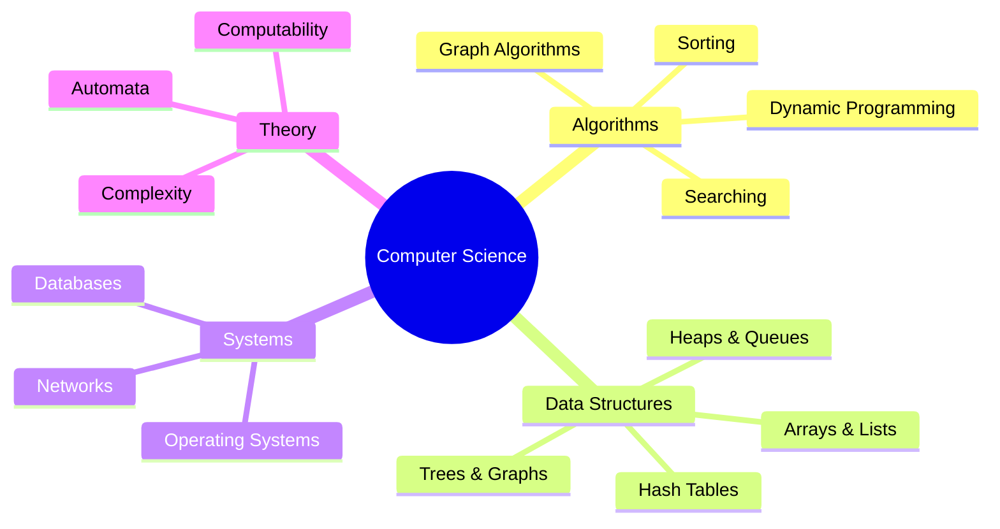
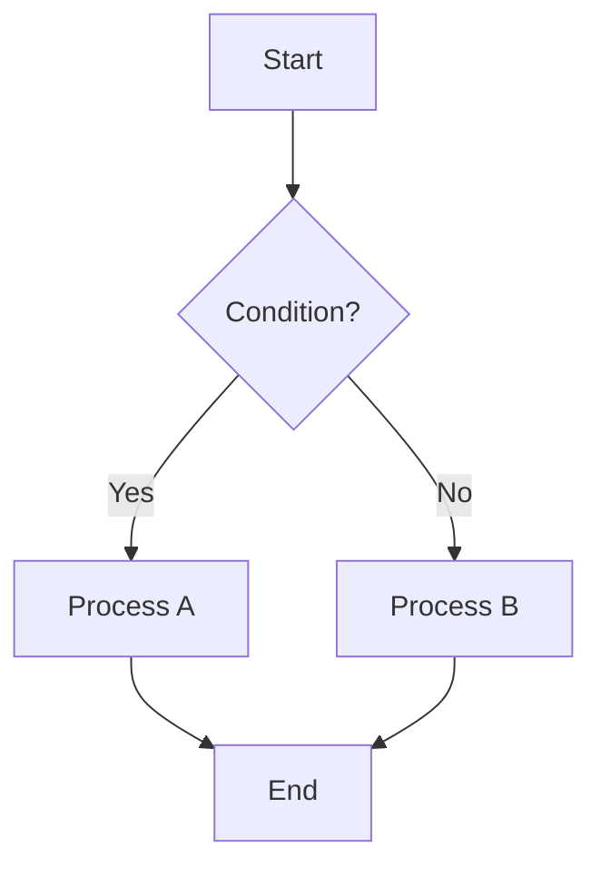
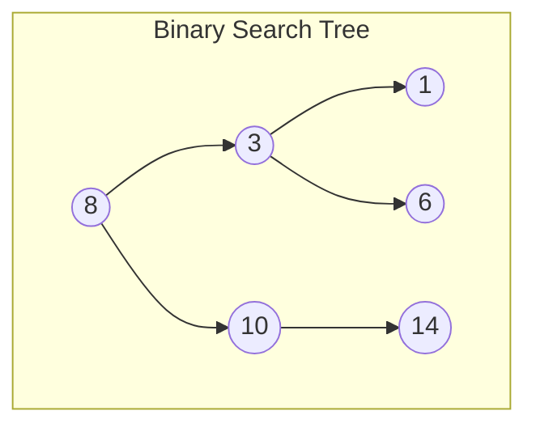
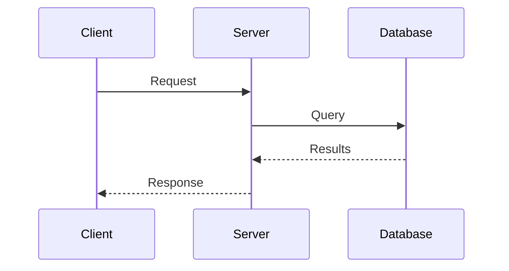

# Computer Science Subject Expert

Specialized knowledge for computer science studying, problem-solving, and note creation.

## Topic Coverage



---

## Quick Reference Links

- **Algorithm Patterns:** See [algorithms.md](references/algorithms.md)
- **Data Structures:** See [data-structures.md](references/data-structures.md)
- **Big-O Analysis:** See [big-o.md](references/big-o.md)

---

## Diagram Patterns

### Algorithm Flowchart



### Data Structure Visualization



### Sequence Diagram (API/Process)



---

## Problem-Solving Framework

### Algorithm Design Steps

1. **Understand** - Clarify inputs, outputs, constraints
2. **Examples** - Work through 2-3 examples by hand
3. **Brute Force** - Start with the obvious O(n²) or O(n!) solution
4. **Optimize** - Apply patterns (two pointers, sliding window, etc.)
5. **Implement** - Write clean, modular code
6. **Test** - Edge cases (empty, single element, duplicates)

### Common Patterns

| Pattern | Use When | Example |
|---------|----------|---------|
| Two Pointers | Sorted array, find pairs | Two Sum (sorted) |
| Sliding Window | Contiguous subarray | Max sum subarray |
| Hash Map | O(1) lookups needed | Two Sum (unsorted) |
| BFS | Shortest path (unweighted) | Maze solving |
| DFS | Explore all paths | Permutations |
| Binary Search | Sorted data, find element | Search rotated array |
| Dynamic Programming | Overlapping subproblems | Fibonacci, Knapsack |

---

## Code Template Patterns

### Binary Search

```python
def binary_search(arr, target):
    left, right = 0, len(arr) - 1
    while left <= right:
        mid = (left + right) // 2
        if arr[mid] == target:
            return mid
        elif arr[mid] < target:
            left = mid + 1
        else:
            right = mid - 1
    return -1  # Not found
```

### BFS Template

```python
from collections import deque

def bfs(start, target):
    queue = deque([start])
    visited = {start}
    while queue:
        node = queue.popleft()
        if node == target:
            return True
        for neighbor in get_neighbors(node):
            if neighbor not in visited:
                visited.add(neighbor)
                queue.append(neighbor)
    return False
```

### DFS Template

```python
def dfs(node, visited):
    if node in visited:
        return
    visited.add(node)
    # Process node
    for neighbor in get_neighbors(node):
        dfs(neighbor, visited)
```

---

## Complexity Quick Reference

| Operation | Array | Linked List | Hash Table | BST (avg) |
|-----------|-------|-------------|------------|-----------|
| Access | O(1) | O(n) | O(1) | O(log n) |
| Search | O(n) | O(n) | O(1) | O(log n) |
| Insert | O(n) | O(1) | O(1) | O(log n) |
| Delete | O(n) | O(1) | O(1) | O(log n) |
