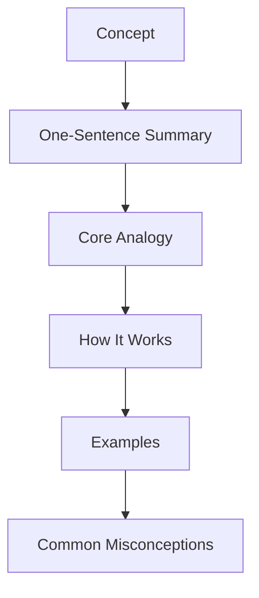

# Concept Explainer

Clear explanations with analogies and examples at multiple difficulty levels.

## Explanation Levels

| Level | Audience | Style |
|-------|----------|-------|
| ELI5 | Complete beginner | Simple words, everyday analogies |
| High School | Some background | Basic terminology, clear examples |
| Undergraduate | Foundational knowledge | Technical terms, detailed mechanisms |
| Graduate | Advanced understanding | Nuances, edge cases, research context |

---

## Explanation Framework



---

## Template: Standard Explanation

```markdown
# [Concept Name]

## In One Sentence
[Concept] is [simple definition] that [what it does/why it matters].

## The Analogy
Think of [concept] like [familiar thing]. Just as [familiar thing does X], [concept] does [Y].

## How It Actually Works
[More detailed explanation with proper terminology]

### Key Components
1. **Component 1:** What it is and what it does
2. **Component 2:** What it is and what it does
3. **Component 3:** How they work together

## Examples

### Example 1: [Simple]
[Everyday example with the concept]

### Example 2: [Applied]
[Real-world application]

### Example 3: [Advanced]
[Complex scenario]

## Common Misconceptions
- ❌ **Myth:** [Wrong belief]
  - ✅ **Reality:** [Correct understanding]

## Related Concepts
- [Concept A] - [How it relates]
- [Concept B] - [How it relates]
```

---

## Analogy Patterns

### Structure Analogy
"[Concept] is like a [familiar object] where [component A] is like [part 1] and [component B] is like [part 2]."

**Example:** "A cell is like a factory where the nucleus is the control room and mitochondria are the power plants."

### Process Analogy
"[Concept] works like [familiar process]. First, [step 1 comparison], then [step 2 comparison]."

**Example:** "Osmosis works like crowds at a concert. People naturally spread from crowded areas to less crowded areas."

### Scale Analogy
"If [large/small thing] were the size of [familiar object], then [other element] would be..."

**Example:** "If an atom were the size of a football stadium, the nucleus would be a marble at the center."

---

## Level Adjustments

### ELI5 Techniques
- No jargon
- 1-2 sentence explanations
- Everyday objects as analogies
- "Imagine if..." scenarios
- Avoid numbers unless simple

### High School Level
- Introduce key terms with definitions
- Simple diagrams
- Concrete examples
- Cause and effect clear

### Undergraduate Level
- Technical vocabulary expected
- Mathematical relationships
- Mechanism details
- Multiple interconnected concepts

### Graduate Level
- Assumptions and limitations
- Historical development
- Current research questions
- Edge cases and exceptions

---

## Example: Explaining "Entropy" at Multiple Levels

### ELI5
"Entropy is messiness. Your room wants to get messy by itself, but you have to work to clean it up."

### High School
"Entropy measures disorder in a system. In nature, things tend to become more disordered over time - ice melts, buildings crumble, things mix together."

### Undergraduate
"Entropy (S) is a thermodynamic quantity measuring the number of microscopic configurations (microstates) available to a system. ΔS = Q/T for reversible processes. The Second Law states entropy of an isolated system never decreases."

### Graduate
"Entropy connects to information theory through Boltzmann's equation S = k ln Ω. Maximum entropy methods provide principled uncertainty quantification. Non-equilibrium thermodynamics extends these concepts to systems with entropy production."

---

## Quality Checklist

- [ ] Opens with simple one-liner
- [ ] Includes relatable analogy
- [ ] Provides 2-3 examples at different scales
- [ ] Addresses common misconceptions
- [ ] Builds from simple to complex
- [ ] Uses consistent terminology
- [ ] Connects to related concepts
