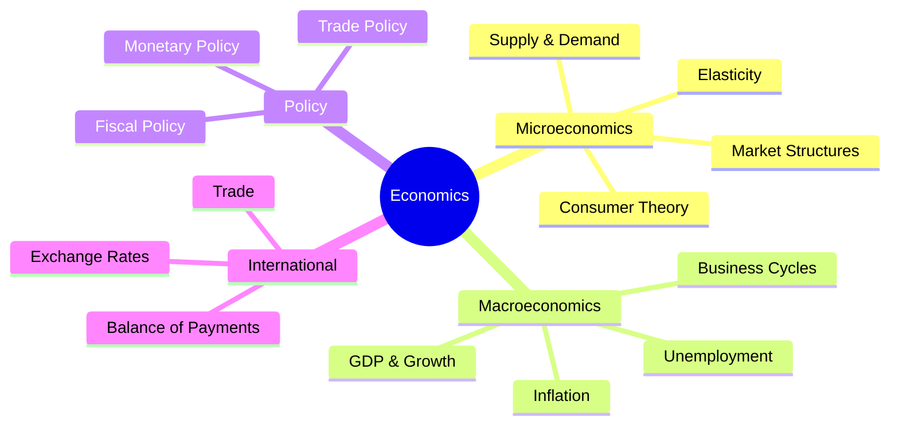

# Economics Subject Expert

Specialized knowledge for economics studying, analysis, and note creation.

## Topic Coverage



---

## Key Diagrams

### Supply and Demand

```
Price
  │
  │     S /
  │      /
  │     / • Equilibrium (P*, Q*)
  │    /
  │   /
  │  /   \ D
  │ /     \
  └───────────── Quantity
```

**Shifts:**
- Demand ↑: Curve shifts right (price ↑, quantity ↑)
- Supply ↑: Curve shifts right (price ↓, quantity ↑)

### Production Possibilities Frontier

```
Good Y
  │\
  │ \
  │  \  ← Efficient
  │   \
  │    \
  │     \
  └──────── Good X
```

---

## Core Formulas

### GDP
$$GDP = C + I + G + (X - M)$$
- C = Consumption
- I = Investment
- G = Government spending
- X = Exports
- M = Imports

### Elasticity
$$E_d = \frac{\% \Delta Q_d}{\% \Delta P}$$

| Elasticity | |E_d| | Description |
|------------|------|-------------|
| Elastic | > 1 | Sensitive to price |
| Inelastic | < 1 | Insensitive to price |
| Unit elastic | = 1 | Proportional change |

### Inflation Rate
$$\text{Inflation} = \frac{CPI_{new} - CPI_{old}}{CPI_{old}} \times 100\%$$

### Unemployment Rate
$$\text{Unemployment} = \frac{\text{Unemployed}}{\text{Labor Force}} \times 100\%$$

---

## Market Structures

| Structure | Firms | Product | Entry | Price Control |
|-----------|-------|---------|-------|---------------|
| Perfect Competition | Many | Identical | Free | None |
| Monopolistic Competition | Many | Differentiated | Free | Some |
| Oligopoly | Few | Similar | Barriers | Significant |
| Monopoly | One | Unique | Blocked | Full |

---

## Fiscal vs Monetary Policy

| Aspect | Fiscal Policy | Monetary Policy |
|--------|---------------|-----------------|
| Authority | Government | Central Bank |
| Tools | Taxes, Spending | Interest rates, Money supply |
| Expansionary | ↓ Taxes, ↑ Spending | ↓ Interest rates |
| Contractionary | ↑ Taxes, ↓ Spending | ↑ Interest rates |

---

## Key Economic Indicators

| Indicator | Measures | Good Sign |
|-----------|----------|-----------|
| GDP Growth | Economic output | 2-3% annually |
| Inflation | Price changes | 2% target |
| Unemployment | Joblessness | < 5% |
| Interest Rate | Cost of borrowing | Stable |

---

## Trade Concepts

### Comparative Advantage
- Country produces good with lower opportunity cost
- Basis for trade even if one country is better at everything

### Exchange Rates
- Appreciation: Currency strengthens (imports cheaper, exports expensive)
- Depreciation: Currency weakens (imports expensive, exports cheaper)
