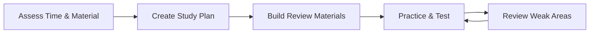

# Exam Prep

Comprehensive exam preparation with study schedules, review sheets, and practice strategies.

## Workflow



---

## Step 1: Assessment

### Time Assessment
1. **Days until exam:** ___
2. **Hours available per day:** ___
3. **Total study hours:** Days × Hours = ___

### Material Assessment
List all topics to cover and rate confidence (1-5):

| Topic | Confidence | Priority |
|-------|------------|----------|
| Topic A | 2 | High |
| Topic B | 4 | Low |
| Topic C | 3 | Medium |

**Priority formula:** Lower confidence = Higher priority

---

## Step 2: Study Plan Templates

### One-Week Plan

| Day | Focus | Activities |
|-----|-------|------------|
| Day 1-2 | Weak topics (Priority: High) | Read, Notes |
| Day 3-4 | Medium topics | Review, Practice |
| Day 5 | Quick review all | Summary sheets |
| Day 6 | Practice test | Full simulation |
| Day 7 | Final review | Weak areas only |

### Two-Week Plan

| Week | Focus |
|------|-------|
| Week 1 | Content learning/review |
| Week 2 | Practice and reinforcement |

### One-Month Plan

| Week | Focus |
|------|-------|
| Week 1 | Learn new/difficult material |
| Week 2 | Reinforce and practice |
| Week 3 | Practice tests, identify gaps |
| Week 4 | Review, light practice, rest |

---

## Step 3: Review Sheet Template

### One-Page Summary Format

```markdown
# [Topic] Cheat Sheet

## Key Concepts (3-5 bullet points)
- Concept 1: Brief explanation
- Concept 2: Brief explanation

## Essential Formulas
| Name | Formula |
|------|---------|
| Formula 1 | [equation] |

## Quick Process Steps
1. Step 1
2. Step 2
3. Step 3

## Common Mistakes to Avoid
- ❌ Wrong approach
- ✅ Correct approach

## Memory Aids
- Mnemonic for [concept]
```

---

## Step 4: Practice Test Strategy

### Creating Practice Tests
1. **Source questions** from textbook, past exams, problem sets
2. **Match format** to actual exam (MCQ, short answer, essay)
3. **Time it** realistically
4. **Grade honestly** with answer key

### During Practice
- Simulate exam conditions (no notes, timed)
- Mark uncertain answers for review
- Track time per section

### After Practice
1. Score and analyze errors
2. Categorize mistakes:
   - Content gap (didn't know)
   - Careless error (knew but missed)
   - Time issue (ran out of time)
3. Focus review on content gaps

---

## Step 5: Exam Day Checklist

### Night Before
- [ ] Review summary sheets (light, no cramming)
- [ ] Prepare materials (pens, calculator, ID)
- [ ] Set alarm(s)
- [ ] Get 7-8 hours sleep

### Exam Day
- [ ] Eat breakfast
- [ ] Arrive early
- [ ] Quick glance at notes (optional)
- [ ] Use bathroom before

### During Exam
- [ ] Read all instructions
- [ ] Quick scan of entire exam
- [ ] Answer easy questions first
- [ ] Budget time appropriately
- [ ] Review answers if time permits

---

## Study Techniques

### Active Recall
Test yourself instead of re-reading
- Flashcards
- Practice problems
- Explain concepts aloud

### Spaced Repetition
Review at increasing intervals:
- Day 1: Learn
- Day 2: Review
- Day 4: Review
- Day 7: Review

### Pomodoro Method
- 25 min focus → 5 min break
- After 4 cycles: 15-30 min break
