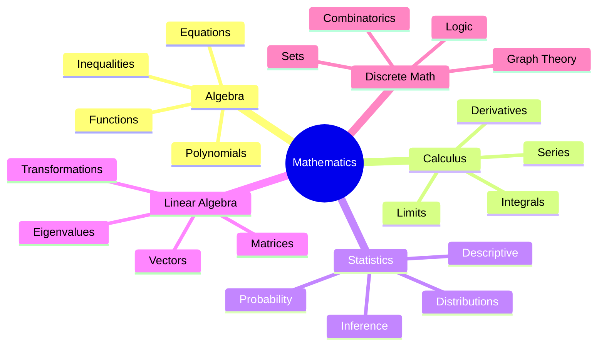

# Mathematics Subject Expert

Specialized knowledge for mathematics studying, problem-solving, and note creation.

## Topic Coverage



---

## Quick Reference Links

- **Formulas:** See [formulas.md](references/formulas.md)
- **Calculus:** See [calculus.md](references/calculus.md)
- **Linear Algebra:** See [linear-algebra.md](references/linear-algebra.md)
- **Statistics:** See [statistics.md](references/statistics.md)

---

## Problem-Solving Framework

### General Steps

1. **Read carefully** - Identify what's given and what's asked
2. **Draw/visualize** - Sketch graphs, diagrams
3. **Choose strategy** - Direct, substitution, contradiction, etc.
4. **Execute** - Show all steps clearly
5. **Verify** - Check answer makes sense

---

## Common Proof Strategies

| Strategy | When to Use | Example |
|----------|-------------|---------|
| Direct Proof | Show P → Q directly | "If n is even, n² is even" |
| Contradiction | Assume ¬Q, derive contradiction | Proving √2 is irrational |
| Contrapositive | Prove ¬Q → ¬P instead | Logical equivalence |
| Induction | Statements about all n ∈ ℕ | Sum formulas |
| Cases | Different scenarios | Piecewise functions |

### Mathematical Induction Template

```
Claim: P(n) is true for all n ≥ 1

Base Case: Show P(1) is true.
[Verify for n = 1]

Inductive Step:
Assume P(k) is true for some k ≥ 1. (Inductive Hypothesis)
Show P(k+1) is true.
[Derive P(k+1) using P(k)]

Therefore, by induction, P(n) is true for all n ≥ 1. ∎
```

---

## Notation Reference

| Symbol | Meaning |
|--------|---------|
| ∀ | For all |
| ∃ | There exists |
| ∈ | Element of |
| ⊂ | Proper subset |
| ⊆ | Subset or equal |
| ∪ | Union |
| ∩ | Intersection |
| ℕ | Natural numbers {1,2,3,...} |
| ℤ | Integers {...,-1,0,1,...} |
| ℚ | Rational numbers |
| ℝ | Real numbers |
| ℂ | Complex numbers |
| ∞ | Infinity |
| ∴ | Therefore |
| ∵ | Because |
| ∎ | QED (proof complete) |

---

## Function Analysis Checklist

1. **Domain** - What x values work?
2. **Range** - What y values result?
3. **Intercepts** - Where x=0, y=0?
4. **Symmetry** - Even f(-x)=f(x)? Odd f(-x)=-f(x)?
5. **Asymptotes** - Vertical, horizontal, oblique?
6. **Critical points** - Where f'(x)=0 or undefined?
7. **Intervals** - Increasing/decreasing?
8. **Concavity** - Where f''(x) > 0 or < 0?
9. **Inflection points** - Where concavity changes?

---

## Common Mistakes to Avoid

1. **Dividing by zero** - Check denominator ≠ 0
2. **Square root of negative** - Consider domain
3. **Forgetting ±** when taking square roots
4. **Chain rule errors** in derivatives
5. **Forgetting +C** in indefinite integrals
6. **Incorrect limit laws** for 0/0, ∞/∞ forms
