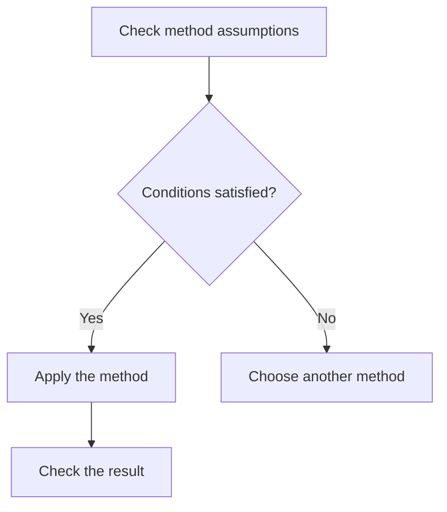

# Visuals That Explain

Choose the representation that reveals the relationship. No note needs a diagram merely to satisfy a quota.

| Need | Representation |
|---|---|
| Short distinction or definition | Prose or table |
| Queue, stack, substitution, small before/after trace | Fenced ASCII/text |
| Branching process, state transitions, actor messages | Mermaid |
| Precise geometry, annotated mechanism, mathematical curve | SVG |
| Formula or derivation | Rendered LaTeX in the note |

## Semantic checks before styling

Decide what the figure teaches and what evidence supports it. Match names, symbols, colours, and values to the note. For numerical figures, derive geometry from the same equations or data as the worked example. Label axes, units, domain, scale, and important points. Distinguish discrete samples from a continuous curve; distinguish a schematic from a calculated plot. Do not imply a guarantee through an arrow or a smooth curve unsupported by the method.

## ASCII

Prefer a small readable trace when alignment carries the explanation. Use a `text` fence, explicit operation labels, and short lines that fit the note pane.

```text
front       back
[A][B][C]          dequeue -> A
   [B][C]          enqueue D
   [B][C][D]       next dequeue -> B
```

## Mermaid

Use flowcharts for decisions, sequence diagrams for actor exchanges, and state diagrams for lifecycle transitions. Keep nodes short; put lengthy mathematics in the surrounding prose. Use stable identifiers and quote labels containing syntax-sensitive characters.



Render using an available compatible Mermaid renderer, preferably the target Obsidian version. A successful external render does not establish compatibility with every Obsidian version. Inspect arrow direction, branch labels, crossings, and readability. Do not rely on syntax checking alone.

## SVG defaults

**Use a white background by default**, including an explicit white rectangle covering the viewBox. Use dark text and axes, restrained accent colours, and light grid lines. This preserves the figure's own contrast in both light and dark vault themes. Change this only for an explicit user preference or a specific output requirement.

- Give the figure a `viewBox` and enough margins for labels and arrowheads.
- Use a consistent type scale; inspect text at the intended embed width, not just at full canvas size.
- Use labels or line styles as well as colour. Avoid tiny legends and overlapping annotations.
- Include a meaningful `<title>` and `<desc>`, and a nearby Markdown sentence explaining what to notice. Do not rely on embedded accessibility metadata alone.
- Keep SVG self-contained: no scripts, external fonts, or remotely loaded images. Escape generated XML text and attributes.
- Reuse the existing asset folder and descriptive filenames. Embed with a resolvable path, for example `![[assets/queue.svg|640]]`, adjusted to the vault layout.

Minimal static skeleton:

```svg
<svg xmlns="http://www.w3.org/2000/svg" viewBox="0 0 640 360"
     role="img" aria-labelledby="title desc">
  <title id="title">Figure title</title>
  <desc id="desc">Describe the relationship illustrated here.</desc>
  <rect width="640" height="360" fill="#ffffff"/>
  <g font-family="sans-serif" font-size="20" fill="#172033">
    <text x="32" y="48">Replace with the actual figure</text>
  </g>
</svg>
```

Use an already available plotting library for calculated curves and charts when it reduces coordinate mistakes; use direct SVG for small geometric diagrams. Retain a generator when reproducing a complex figure would otherwise be difficult. Do not add a new graphics framework for a simple drawing.

## Render and inspect

Parse SVG XML, then render and visually inspect the actual output. Check clipping, whitespace, contrast, labels, scale, and consistency with the calculation. Inspect at the intended embed size on a representative note background. Fix defects and inspect again. If rendering is unavailable, report that limitation rather than calling the visual validated.
