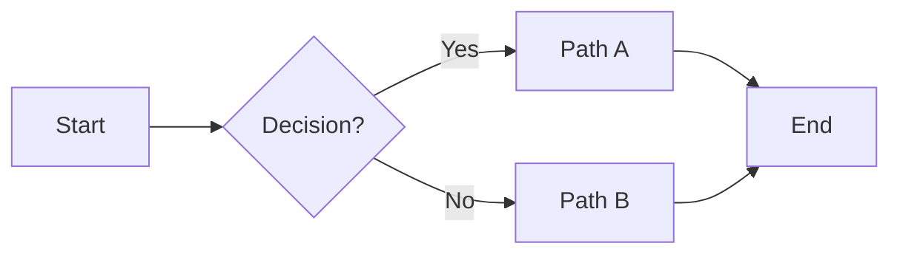
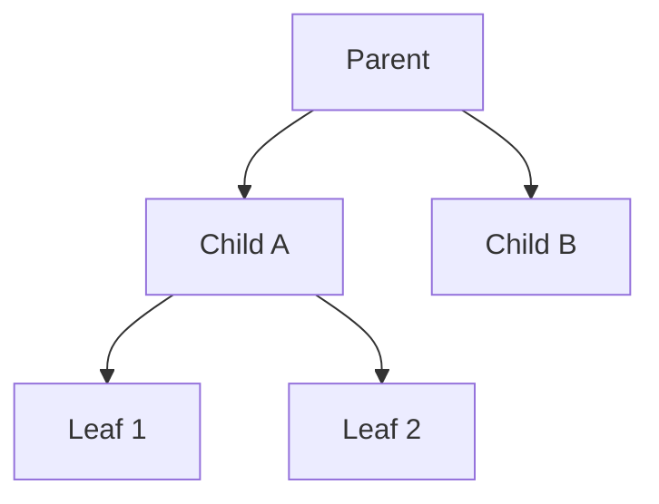
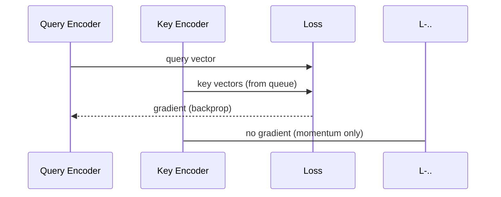
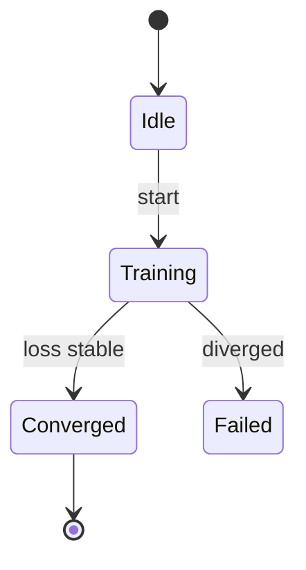
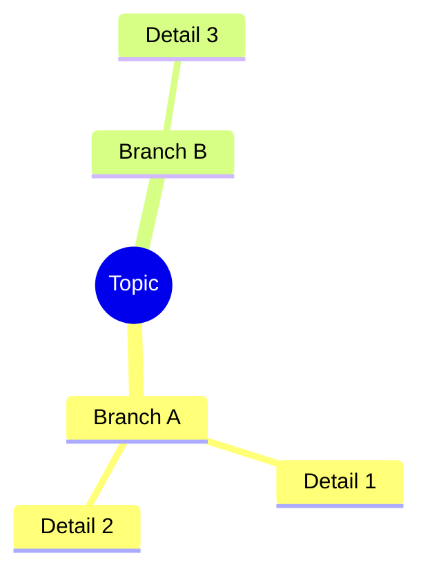
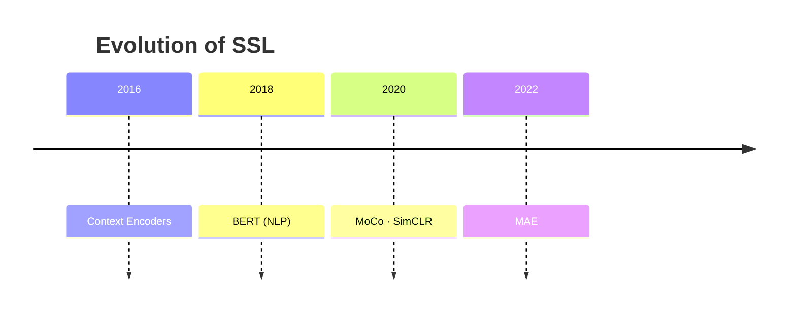
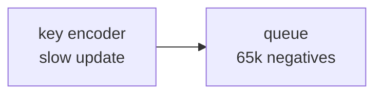

# Diagrams Reference

Two tools: **Mermaid** (preferred) and **ASCII** (for cases Mermaid can't handle).

---

## Mermaid — Which Type to Use

| Diagram type | Use when… | Avoid when… |
|---|---|---|
| `flowchart LR/TB` | Process flow, decision trees, cause → effect | Showing time order between actors |
| `sequenceDiagram` | Two or more actors exchanging messages over time | Simple one-actor process |
| `stateDiagram-v2` | Lifecycles, phases, state machines | Things without clear states |
| `mindmap` | Topic overview, brainstorming, classification trees | Processes with order |
| `timeline` | Historical events, evolution of a concept | Non-time-ordered things |
| `flowchart TB` (tree) | Hierarchies, taxonomies, "A is a type of B" | Cyclic relationships |

---

## Mermaid Templates

### Flowchart — Process / Decision


### Flowchart TB — Hierarchy / Taxonomy


### Sequence Diagram — Actors Exchanging Messages


### State Diagram — Lifecycle / Phases


### Mind Map — Topic Overview


### Timeline — Historical / Evolution


---

## Multi-line Node Labels

Use backtick strings for multi-line text inside nodes:



---

## ASCII Diagrams — When to Use

Use ASCII **only** when:
- You need a **custom layout** that Mermaid can't express (e.g., showing a fraction, a queue buffer, a training loop state)
- You want to show **before vs. after** side by side
- You need to annotate specific parts of a diagram with arrows mid-content

### Box Characters Reference
```
Corners:   ┌ ┐ └ ┘
Lines:     ─ (horizontal)   │ (vertical)
T-joints:  ├ ┤ ┬ ┴   Cross: ┼
Arrows:    → ← ↑ ↓   ▶ ◀ ▲ ▼
Double:    ═ ║ ╔ ╗ ╚ ╝
```

### Overview Box
```
┌─────────────────────────────────────────┐
│              TOPIC TITLE                │
├─────────────────────────────────────────┤
│  Concept A      Concept B      Concept C│
│     │               │              │   │
│  [detail]        [detail]       [detail]│
└─────────────────────────────────────────┘
```

### Layer / Stack
```
┌─────────────────────────────────────────┐
│              Top Layer                  │
├─────────────────────────────────────────┤
│              Middle Layer               │
├─────────────────────────────────────────┤
│              Bottom Layer               │
└─────────────────────────────────────────┘
```

### Queue / Buffer
```
Front                                  Back
  ↓                                     ↓
[k_1][k_2][k_3][ ... ][k_N]   ← FIFO queue
  ↑ dequeue                    enqueue ↑
(oldest removed)              (newest added)
```

### Before / After Contrast
```
WITHOUT momentum:                WITH momentum:
  Encoder v1  →  z_A (valid)      Encoder v1.000 → z_A (valid)
  [big update]                    [tiny update: Δ=0.001]
  Encoder v2  →  z_B              Encoder v1.001 → z_B (still ~valid)
  z_A vs z_B: INCOMPARABLE        z_A vs z_B: COMPARABLE
```
