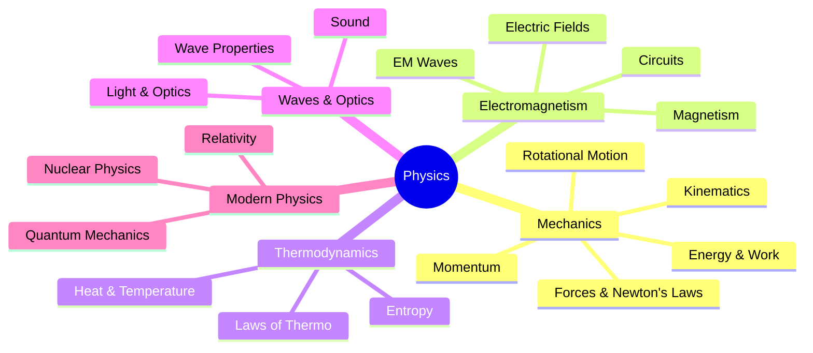
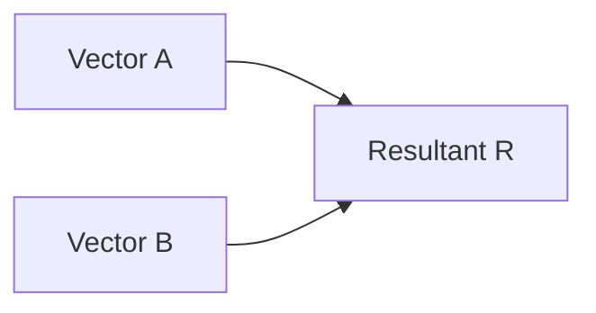

# Physics Subject Expert

Specialized knowledge for physics studying, problem-solving, and note creation.

## Topic Coverage



---

## Quick Reference Links

- **Formulas and Constants:** See [formulas.md](references/formulas.md)
- **Mechanics Problems:** See [mechanics.md](references/mechanics.md)
- **Electromagnetism:** See [electromagnetism.md](references/electromagnetism.md)

---

## Diagram Patterns

### Free Body Diagram (ASCII)

```
                 N (Normal)
                 ↑
                 │
    f ←─────────┼─────────→ F (Applied)
    (friction)  │      
                │
                ↓
                W (Weight = mg)
```

### Vector Addition



### Circuit Diagram (ASCII)

```
    ┌────/\/\/\/────┐
    │      R        │
  ──┴──           ──┴──
  + │ -  Battery   │
  ──┬──           ──┬──
    │               │
    └───────────────┘
```

---

## Problem-Solving Framework

### General Steps

1. **Draw a diagram** - Visualize the situation
2. **List knowns and unknowns** - Organize given data
3. **Choose equations** - Match variables to formulas
4. **Solve algebraically first** - Keep symbols until the end
5. **Substitute values** - Include units
6. **Check answer** - Units, magnitude, direction

### Kinematics Problem Pattern

```
Given: v₀, a, t (or any 3 of 5 variables)
Find: x, v (or remaining variables)

Equations to choose from:
1. v = v₀ + at
2. x = v₀t + ½at²
3. v² = v₀² + 2ax
4. x = ½(v₀ + v)t
```

### Force Problem Pattern

```
1. Draw free body diagram
2. Choose coordinate system
3. Apply ΣF = ma in each direction
4. Solve system of equations
```

---

## Key Concepts Summary

### Newton's Laws

| Law | Statement | Equation |
|-----|-----------|----------|
| 1st | Object at rest stays at rest | If ΣF = 0, v = constant |
| 2nd | F = ma | ΣF = ma |
| 3rd | Action = Reaction | F₁₂ = -F₂₁ |

### Energy Conservation

$$E_{total} = KE + PE = \text{constant (in isolated system)}$$

$$KE = \frac{1}{2}mv^2 \quad PE_{gravity} = mgh \quad PE_{spring} = \frac{1}{2}kx^2$$

### Momentum Conservation

$$p = mv \quad \Sigma p_{before} = \Sigma p_{after}$$

---

## Common Mistakes to Avoid

1. **Forgetting to convert units** (km to m, hours to seconds)
2. **Wrong sign convention** (acceleration vs. deceleration)
3. **Using wrong kinematic equation** (check which variable is missing)
4. **Ignoring friction when it's present**
5. **Confusing instantaneous vs. average values**
