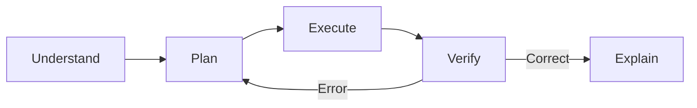

# Problem Solver

Structured problem-solving with step-by-step explanations.

## Problem-Solving Framework



---

## Step 1: Understand (Identify)

### Questions to Ask
1. **What is given?** List all known information
2. **What is asked?** Clearly state what to find
3. **What type of problem?** Categorize (algebra, kinematics, etc.)
4. **What are the constraints?** Any restrictions or conditions

### Template
```markdown
**Given:**
- [List all known values with units]

**Find:**
- [What we need to calculate]

**Type:**
- [Problem category]
```

---

## Step 2: Plan (Strategy)

### Choose Approach
| Problem Type | Common Strategies |
|--------------|-------------------|
| Equation solving | Isolation, substitution, factoring |
| Word problems | Define variables, write equations |
| Physics | Draw diagram, identify forces/energies |
| Proofs | Direct, contradiction, induction |
| Optimization | Take derivative, find critical points |

### Write Steps (Before Executing)
1. First, I will...
2. Then, I will...
3. Finally, I will...

---

## Step 3: Execute (Solve)

### Show All Work
```markdown
**Step 1:** [Action]
[Mathematical work]
= [Result]

**Step 2:** [Action]
[Mathematical work]
= [Result]

**Step 3:** [Final calculation]
[Work]
= [Final answer with units]
```

### Best Practices
- One step at a time
- Include units throughout
- Box or highlight final answer
- Keep work organized vertically

---

## Step 4: Verify (Check)

### Verification Methods

| Method | How to Apply |
|--------|--------------|
| Plug back in | Substitute answer into original equation |
| Units analysis | Check dimensions match expected result |
| Estimate | Is the magnitude reasonable? |
| Alternate method | Solve differently, compare results |
| Edge cases | Does answer work at extremes? |

### Template
```markdown
**Check:**
- Substituting x = [answer] into original equation:
  [show substitution] = [expected value] ✓
- Units: [unit analysis]
- Reasonableness: [is the answer logical?]
```

---

## Teaching Modes

### Hint Mode
Give progressive hints, not full solutions:

**Hint 1:** "What type of problem is this?" (Identification)
**Hint 2:** "What formula relates these quantities?" (Direction)
**Hint 3:** "Try isolating variable X first." (Specific guidance)

### Socratic Mode
Guide through questions:
- "What do you notice about the given information?"
- "What principle applies here?"
- "What would happen if you tried...?"

### Full Solution Mode
Complete step-by-step solution with explanations.

---

## Common Problem Patterns

### Pattern 1: Solve for X
1. Simplify both sides
2. Collect X terms on one side
3. Isolate X

### Pattern 2: Word Problem
1. Define variables
2. Translate words to equations
3. Solve system of equations
4. Answer in context

### Pattern 3: Rate Problem
1. Identify rate (units per time)
2. Use: Amount = Rate × Time
3. Set up equation and solve

### Pattern 4: Optimization
1. Write objective function
2. Take derivative
3. Set equal to zero
4. Solve for critical points
5. Test for max/min

---

## Answer Template

```markdown
## Problem
[State the problem]

## Solution

### Understanding
- **Given:** [knowns]
- **Find:** [unknown]

### Approach
[Brief strategy explanation]

### Work
**Step 1:** [action]
[calculation]

**Step 2:** [action]
[calculation]

### Answer
**[Final answer with units]**

### Verification
[Check work]
```
